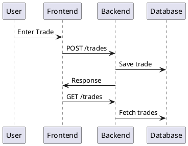

# SPEC-1-Tradezen Trade Journal App

---

## 🧠 Background

Tradezen is a web-based trade journal application designed for **retail traders (intermediate to advanced)** trading Forex, metals, and indices (US & India).

Most traders rely on spreadsheets or fragmented tools, which lack:

* Structured trade logging
* Reliable analytics
* Real-time market context
* Strategy tracking

Tradezen solves this by providing:

* Clean trade logging (manual + CSV later)
* Performance analytics (PnL, win rate, drawdown)
* Real-time price tracking
* Strategy and behavioral insights

---

## ✅ Requirements

### Must Have (MVP)

* Trade logging (symbol, entry, exit, lot, direction)
* PnL calculation
* Trade list view
* Basic dashboard (PnL, win rate)
* PostgreSQL persistence
* Web-based UI
* Backend API (CRUD trades)

---

### Should Have

* Strategy tagging
* Filters (symbol, date)
* Equity curve
* Risk metrics (RR, drawdown)

---

### Could Have

* CSV import
* Live price tracking (WebSocket)
* Trade screenshots
* Psychology tracking

---

### Won’t Have (MVP)

* Auto trading
* Social features
* Portfolio optimization

---

## ⚙️ Method

---

### 🏗️ Architecture Overview

```plantuml
@startuml
Frontend (Next.js) --> Backend (NestJS)
Backend --> PostgreSQL
@enduml
```

---

### 🧱 Monorepo Structure

```text
tradezen/
  apps/
    web/        # Next.js frontend
    api/        # NestJS backend
  packages/
    types/      # shared types
```

---

### 🧩 Tech Stack

| Layer         | Technology                                 |
| ------------- | ------------------------------------------ |
| Frontend      | Next.js (App Router, TypeScript, Tailwind) |
| Backend       | NestJS                                     |
| Database      | PostgreSQL                                 |
| Runtime       | Node.js                                    |
| Infra (later) | AWS + Vercel                               |
| Monorepo      | Turborepo                                  |

---

### 🗄️ Database Schema

```sql
CREATE TABLE trades (
  id UUID PRIMARY KEY DEFAULT uuid_generate_v4(),
  symbol TEXT,
  direction TEXT,
  entry_price NUMERIC,
  exit_price NUMERIC,
  lot_size NUMERIC,
  pnl NUMERIC,
  created_at TIMESTAMP DEFAULT NOW()
);
```

---

### 🔁 Trade Flow



---

### 📡 API Design

#### Trades

```http
POST /trades
GET /trades
```

---

### 🧮 PnL Logic

```text
Buy  → (Exit - Entry) * Lot
Sell → (Entry - Exit) * Lot
```

---

### 🧩 Shared Types

```ts
export type Trade = {
  id: string;
  symbol: string;
  direction: "buy" | "sell";
  entry_price: number;
  exit_price: number;
  pnl: number;
};
```

---

## 🛠️ Implementation

---

### Phase 1 — Setup Monorepo

* Create Turborepo
* Add `apps/web` and `apps/api`
* Setup shared types

---

### Phase 2 — Database

* Run PostgreSQL (Docker)
* Create database `tradezen`
* Create `trades` table

---

### Phase 3 — Backend

* Setup NestJS
* Install `pg`
* Create:

  * Trades module
  * Controller
  * Service
* Implement:

  * `POST /trades`
  * `GET /trades`

---

### Phase 4 — Frontend

* Setup Next.js (App Router)
* Create:

  * Add Trade page
  * Trade List page
* Create API helper (`lib/api.ts`)
* Connect frontend to backend

---

### Phase 5 — Integration

* Test end-to-end:

  * Add trade
  * Save to DB
  * Fetch trades
  * Display UI

---

## 🎯 Milestones

| Milestone | Outcome                   |
| --------- | ------------------------- |
| M1        | Monorepo setup complete   |
| M2        | Database created          |
| M3        | Backend API working       |
| M4        | Frontend form working     |
| M5        | End-to-end working system |

---

## 📊 Gathering Results

### Product Metrics

* Trades logged per user
* Daily active users
* Retention rate

---

### System Metrics

* API latency (< 500ms)
* DB query performance
* Error rate

---

### Success Criteria

* Users can log trades in < 10 seconds
* Data persists reliably
* Metrics update correctly

---

## ⚠️ Core Rules

* Never lose user trade data
* PnL must always be deterministic
* Backend must be source of truth
* Frontend must never compute critical metrics alone

---

## 🚀 Future Enhancements

* Live price tracking (Redis + WebSockets)
* Analytics engine
* Strategy tagging
* AI insights
* Mobile app

---

## 🧠 Final Note

This design prioritizes:

* Simplicity
* Speed of execution
* Clean architecture
* Scalability

> Build → Ship → Improve

---

## Need Professional Help in Developing Your Architecture?

Please contact me at [sammuti.com](https://sammuti.com) 🙂
