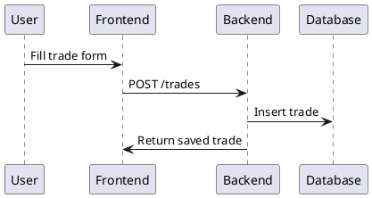
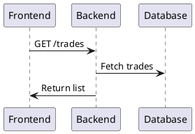
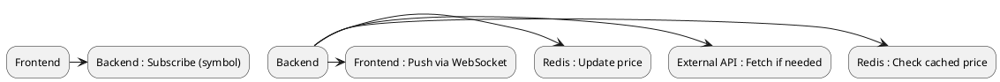

# Method (v1 - Finalized Architecture) — Tradezen

---

## 🏗️ Architecture Overview

Tradezen follows a **modular, scalable monorepo architecture** with support for **real-time market data**, clean separation of concerns, and future scalability.

```plantuml
@startuml
Frontend (Next.js) --> Backend (NestJS)
Backend --> PostgreSQL
Backend --> Redis
Backend --> External Market Data API
Frontend <-- Backend : WebSocket (live prices)
@enduml
```

---

## 🧱 Monorepo Structure

```text
tradezen/
  apps/
    web/        # Next.js frontend
    api/        # NestJS backend
  packages/
    types/      # shared types across frontend & backend
```

---

## 🧩 Core Components

---

### 1. Frontend (apps/web)

- Framework: **Next.js (App Router)**
- Language: **TypeScript**
- Styling: **TailwindCSS**

#### Responsibilities:
- Trade input (Add Trade form)
- Display trade list
- Dashboard (PnL, win rate)
- Real-time price display (WebSocket)
- Communicate with backend via REST + WebSocket

---

### 2. Backend (apps/api)

- Framework: **NestJS**
- Language: **TypeScript**
- Database Driver: **pg (node-postgres)**

#### Responsibilities:
- Handle API requests
- Business logic (PnL calculation)
- Data validation
- Database interaction
- Market data integration
- WebSocket server for live updates

---

### 3. Database (PostgreSQL)

- Stores all persistent data
- Source of truth for trades

---

### 4. Cache Layer (Redis)

- Stores live market prices
- Reduces external API calls
- Enables fast real-time updates

---

### 5. Market Data Service

- Fetches live prices (Forex, metals, indices)
- Polls external APIs (e.g., Twelve Data)
- Updates Redis cache

---

### 6. Shared Types (packages/types)

- Shared TypeScript interfaces
- Prevents mismatch between frontend & backend

Example:

```ts
export type Trade = {
  id: string;
  symbol: string;
  direction: "buy" | "sell";
  entry_price: number;
  exit_price: number;
  pnl: number;
};
```

---

## 🗄️ Database Design

### Trades Table

```sql
CREATE TABLE trades (
  id UUID PRIMARY KEY DEFAULT uuid_generate_v4(),
  symbol TEXT,
  direction TEXT,
  entry_price NUMERIC,
  exit_price NUMERIC,
  lot_size NUMERIC,
  pnl NUMERIC,
  created_at TIMESTAMP DEFAULT NOW()
);
```

---

## 🔁 Data Flow

### Trade Creation Flow



---

### Trade Retrieval Flow



---

### Live Price Flow



---

## 📡 API Design

### Trade Endpoints

```http
POST /trades   # Create trade
GET  /trades   # Fetch all trades
```

---

### Market Data Endpoints

```http
GET /market/price?symbol=EURUSD
WS  /market/stream
```

---

## 🧮 Core Business Logic

### PnL Calculation

```text
If BUY:
  PnL = (Exit Price - Entry Price) * Lot Size

If SELL:
  PnL = (Entry Price - Exit Price) * Lot Size
```

---

## ⚙️ Backend Module Structure

```text
apps/api/src/
  trades/
    trades.controller.ts
    trades.service.ts
    trades.module.ts
  market/
    market.service.ts
    market.gateway.ts
  db.ts
```

---

## ⚡ Frontend Structure

```text
apps/web/
  app/
    add-trade/
      page.tsx
    trades/
      page.tsx
    dashboard/
      page.tsx
  lib/
    api.ts
```

---

## 🔗 Frontend ↔ Backend Communication

- REST → CRUD operations
- WebSocket → live price updates

Example:

```ts
POST /trades
{
  "symbol": "XAUUSD",
  "direction": "buy",
  "entry": 2300,
  "exit": 2320,
  "lot": 1
}
```

---

## 🚀 Future Enhancements

- Advanced analytics engine
- Strategy tagging
- CSV import system
- AI-based trade insights
- Mobile app

---

## ⚠️ Architectural Rules

- Backend is the **single source of truth**
- Frontend must not compute critical financial logic
- Live prices must never overwrite trade data
- Redis is used only for caching (not persistence)
- Shared types must be consistent across services

---

## 🧠 Design Principles

- **Simplicity first (MVP focus)**
- **Separation of concerns**
- **Real-time capability built-in**
- **Scalable architecture**
- **Deterministic calculations**

---

## 🎯 Summary

Tradezen uses a **modern, scalable architecture** with:

- Next.js frontend
- NestJS backend
- PostgreSQL database
- Redis for caching
- WebSocket for real-time data
- Shared type system

This ensures:
- Fast development
- Real-time capabilities
- Clean scalability path
- Strong data integrity

---

